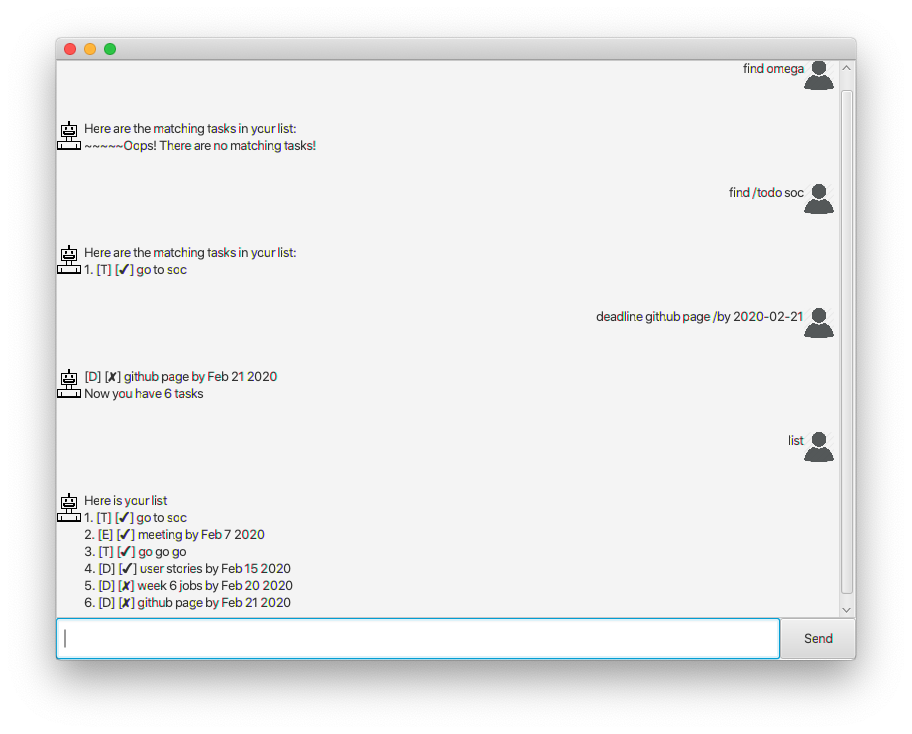

# Duke
##### Duke is a very simple CLI task management application.
##### This version of Duke was developed by Nhat Nguyen | NNpanpan.

## User Guide
##### Below is the guide to the usage of Duke. All the commands are listed.

## Features 

### 1. `todo` 
##### Format: `todo <TASK_NAME>`
##### Add a **ToDo** task to your list.
##### Example: `todo go to soc`

### 2. `deadline`
##### Format: `deadline <TASK_NAME> /by <DATE>`
##### Add a **Deadline** task to your list.
##### Example: `deadline duke UG /by 2020-02-21`

### 3. `event`
##### Format: `event <TASK_NAME> /at <DATE>`
##### Add an **Event** task to your list.
##### Example: `event cs2103t tutorial 5 /at 2020-02-21`

### 4. `list`
##### Format: `list`
##### List your entire task list.

### 5. `done`
##### Format: `done <INDEX>`
##### Mark the task at position **INDEX** on your list as done.
##### Will fail if **INDEX** is out of bound.
##### If the task is already done, you'll be notified so.
##### Example: `done 3`

### 6. `delete`
##### Format: `delete <INDEX>`
##### Delete the task at position **INDEX** on your list.
##### Will fail if **INDEX** is out of bound.
##### Example: `delete 3`

### 7. `find`
#### Basic `find`
##### Format: `find <STRING>`
##### Find and return the tasks whose names contain **STRING**.
##### Example: `find soc`
#### Advanced `find`
##### Format: `find /TASK_TYPE <STRING>`
##### Find and return the tasks with type **TASK_TYPE** whose names contain **STRING**.
##### Example: `find /deadline cs2103t`

### 8. `bye`
##### Format: `bye`
##### Indicates that you have finished your usage and exits the program.

## Sample session

